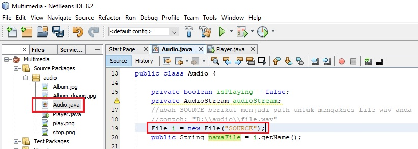
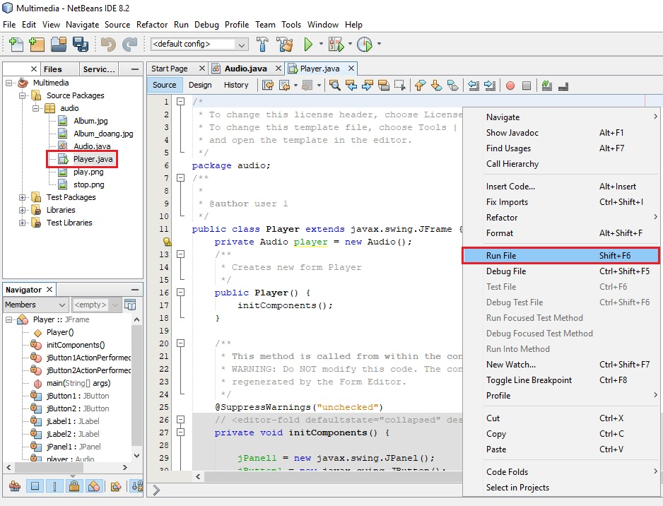
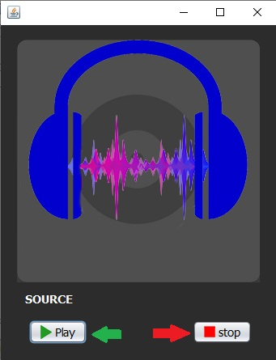

### Deskripsi

Program ini adalah program sederhana untuk memutar file audio yang berformat `.wav` saja. Program ini tidak bisa memutar audio dengan format lain karena keterbatasan library yang digunakan, yaitu `FileInputStream` dari `java.io`

### Instalasi

Hal yang perlu disiapkan adalah:
-	Java 8 atau lebih
-	NetBeans IDE

Untuk instalasi, cukup clone repository ini menggunakan Git bash atau download source code menggunakan tombol Code => Download ZIP di repository ini ke folder penyimpanan di komputer anda

### Penggunaan

-	Buka source code project di NetBeans IDE
-	Buka file `Audio.java` yang ada di folder `src/audio/`
-	Cari tulisan source kemudian ubah menjadi path menuju file anda

-	Buka file `Player.java` yang ada di folder yang sama
-	Kemudian klik kanan lalu pilih "Run File" dan program akan berjalan

-	Setelah jendela tampilan terbuka klik tombol `play` untuk memutar file dan `stop` untuk berhenti memutar

